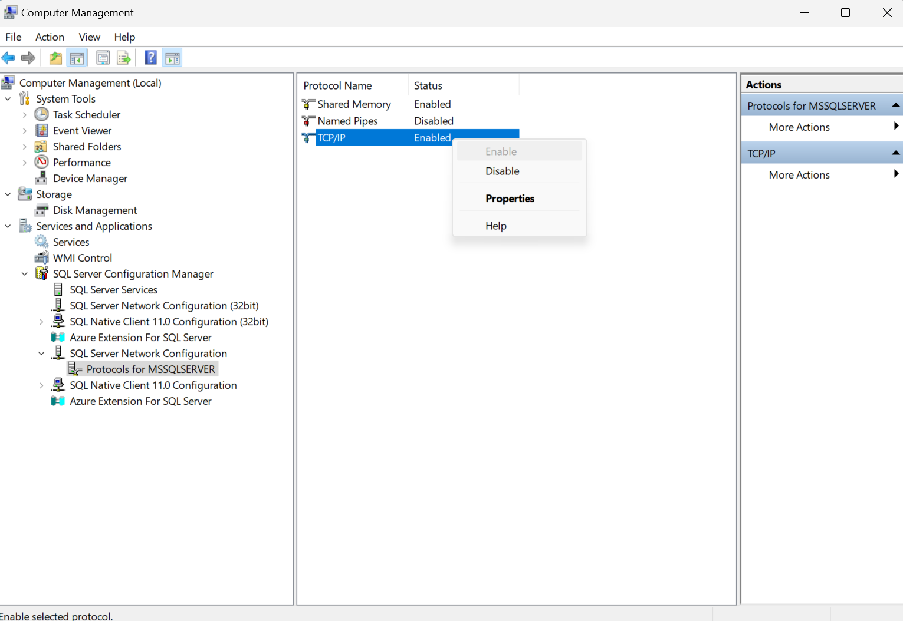

# School Registration System

## Table of Contents

<ul>
  <li><a href='#er-diagram'>ER Diagram</a></li>
  <li><a href='#tables'>Tables</a></li>
  <li><a href='#to-use-insert-scripts'>To Use Insert Scripts</a></li>
  <li><a href='#requirments'>Requirements</a></li>
  <li><a href='#available-scripts'>Available Scripts</a></li>
  <li><a href='#troubleshooting'>Troubleshooting</a></li>
</ul>

## ER Diagram


## Tables


## TO USE INSERT SCRIPTS

- Create .env
- `npm i`
- `npm run init-xxxxx`

## Requirements

- [ ] Stored Procedures
- [ ] Materialized Views
- [ ] Transactions
- [ ] Indicies

## .env

Create .env file with the required information:

```
DB_USER="YOUR_USERNAME"
DB_PASSWORD="YOUR_PASSWORD"
DB_SERVER="YOUR_SERVER_NAME"
DB_NAME="YOUR_DATABASE_NAME"
```

## Available Scripts

In the project directory, you can run:

### `npm start`

Runs the app in the development mode.\
Open [http://localhost:3000](http://localhost:3000) to view it in your browser.

### `npm run init-students`

Runs the initStudents.js file and inserts student data into the students table

### `npm run init-courses`

Runs the initCourses.js file and inserts student data into the students table

### `npm run init-prereqs`

Runs the initPrereqs.js file and generates prereqs for some courses

### `npm run init-teachers`

Runs the initTeacherss.js file and generates teachers

## Troubleshooting

### Login Error

Make sure SQL Server Authentication is on:
See this video: <a href='https://www.youtube.com/watch?v=nKlIMvgL1vI'>link</a>


Enable TCP/IP for sql server:

