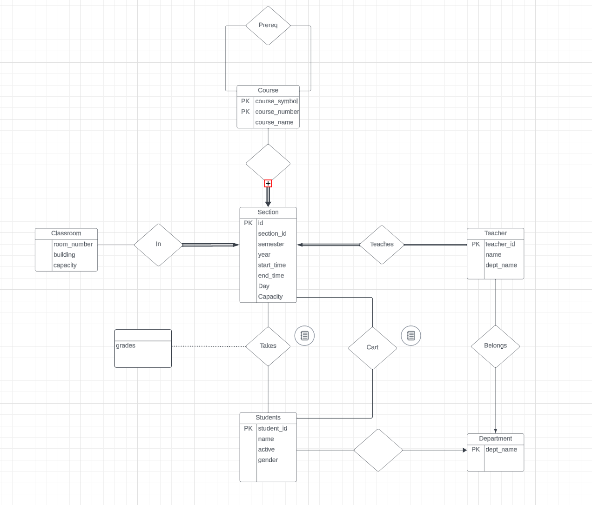

# School Registration System
## Requirements
- [ ]  Stored Procedures  
- [ ]  Materialized Views
- [ ]  Transactions
- [ ]  Indicies

## .env
Create .env file with the required information:
```
DB_USER="YOUR_USERNAME"
DB_PASSWORD="YOUR_PASSWORD"
DB_SERVER="YOUR_SERVER_NAME"
DB_NAME="YOUR_DATABASE_NAME"
```

## Available Scripts

In the project directory, you can run:

### `npm start`

Runs the app in the development mode.\
Open [http://localhost:3000](http://localhost:3000) to view it in your browser.

### `npm run init-students`

Runs the initDB.js file and inserts student data into the students table

## ER Diagram


## Troubleshooting 
### Login Error
Make sure SQL Server Authentication is on:
See this video: <a href='https://www.youtube.com/watch?v=nKlIMvgL1vI'>link</a>


